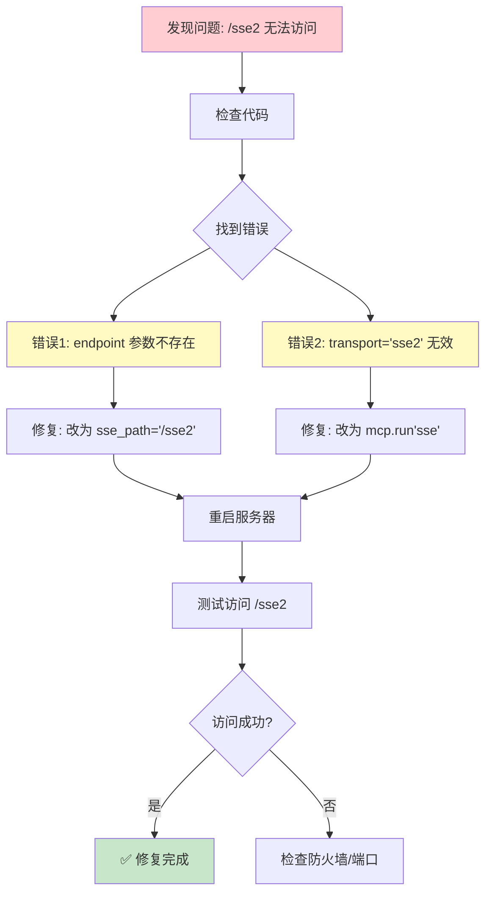

# SSE2 路径修复说明

## 🔍 问题分析

### 原因
代码使用了错误的 FastMCP 参数名称，导致 SSE 路径配置未生效。

### 问题位置
在 `src/server.py` 文件中有两处错误：

1. **第 52 行** - 错误的参数名：
   ```python
   # ❌ 错误：使用了不存在的 endpoint 参数
   mcp = FastMCP(..., endpoint='/sse2')
   ```

2. **第 186 行** - 错误的 transport 参数值：
   ```python
   # ❌ 错误：'sse2' 不是有效的 transport 类型
   mcp.run('sse2')
   ```

### FastMCP 正确的参数说明

根据 FastMCP 框架的官方参数定义：

**FastMCP.__init__ 参数：**
- ✅ `sse_path: str = '/sse'` - SSE 路径配置（默认 '/sse'）
- ✅ `mount_path: str = '/'` - 挂载路径配置（默认 '/'）
- ❌ `endpoint` - 不存在此参数

**mcp.run() 参数：**
- `transport: Literal['stdio', 'sse', 'streamable-http']` - 传输协议类型
- 只能是以下三个值之一：
  - `'stdio'` - 标准输入输出
  - `'sse'` - Server-Sent Events（服务器推送事件）
  - `'streamable-http'` - 可流式传输的 HTTP

---

## ✅ 修复方案

### 修改 1：更正 FastMCP 初始化参数

**位置：**`src/server.py` 第 52 行

**修改前：**
```python
mcp = FastMCP("MySQL Query Server", "cccccccccc", host=host, port=port, debug=True, endpoint='/sse2')
```

**修改后：**
```python
mcp = FastMCP("MySQL Query Server", "cccccccccc", host=host, port=port, debug=True, sse_path='/sse2')
```

**说明：**将 `endpoint` 改为 `sse_path`，这是 FastMCP 框架正确的参数名。

---

### 修改 2：更正 run 方法的 transport 参数

**位置：**`src/server.py` 第 186 行

**修改前：**
```python
mcp.run('sse2')
```

**修改后：**
```python
mcp.run('sse')
```

**说明：**transport 参数必须是 `'sse'` 而不是 `'sse2'`，这是传输协议类型，不是路径。

---

## 🎯 修复后的效果

### 启动服务器后：
```bash
$ python -m src.server
开始启动MySQL查询SSE服务器...
服务器监听在 127.0.0.1:3000/sse2
```

### 访问地址：
- ✅ **正确访问地址：** `http://127.0.0.1:3000/sse2`
- ❌ **旧地址失效：** `http://127.0.0.1:3000/sse`

---

## 📚 技术原理说明

### 为什么会出现这个问题？

1. **参数名混淆：**
   - 代码作者可能以为参数名是 `endpoint`
   - 但 FastMCP 实际使用的是 `sse_path`
   - 当传入不存在的参数时，FastMCP 会忽略它并使用默认值 `'/sse'`

2. **Transport 类型混淆：**
   - `mcp.run()` 的第一个参数是**传输协议类型**，不是路径
   - 路径已经在 `FastMCP()` 初始化时通过 `sse_path` 指定
   - `'sse2'` 不是有效的 transport 类型，应该用 `'sse'`

### FastMCP 的工作流程

```
1. 创建 FastMCP 实例
   └─> 设置 sse_path='/sse2' (定义 SSE 路径)
       设置 host='127.0.0.1' (定义监听地址)
       设置 port=3000 (定义监听端口)

2. 调用 mcp.run('sse')
   └─> 使用 'sse' 传输协议
       在地址 http://127.0.0.1:3000/sse2 启动服务
```

### 类比理解（用开餐厅的例子）

```
FastMCP 初始化 = 装修餐厅
├─ host = 餐厅街道地址
├─ port = 餐厅门牌号
└─ sse_path = 取餐窗口号码

mcp.run() = 开门营业
└─ transport = 营业方式（堂食/外卖/自提）
```

使用错误的参数名 `endpoint` 就像告诉装修工人一个不存在的指令，他们会按默认方案装修（使用 `/sse`）。

---

## 🔧 如何自定义 SSE 路径

如果你想修改为其他路径，比如 `/api/mysql`：

### 方法 1：直接修改代码

```python
# src/server.py 第 52 行
mcp = FastMCP("MySQL Query Server", "cccccccccc", 
              host=host, port=port, debug=True, 
              sse_path='/api/mysql')  # 修改这里

# 第 186 行保持不变
mcp.run('sse')  # transport 保持为 'sse'
```

访问地址将变为：`http://127.0.0.1:3000/api/mysql`

### 方法 2：通过环境变量配置（推荐）

**步骤 1：** 修改 `src/config.py`，添加配置项：

```python
class ServerConfig:
    HOST = os.getenv('HOST', '127.0.0.1')
    PORT = int(os.getenv('PORT', '3000'))
    SSE_PATH = os.getenv('SSE_PATH', '/sse2')  # 新增
```

**步骤 2：** 修改 `src/server.py`，使用配置：

```python
from src.config import ServerConfig

host = ServerConfig.HOST
port = ServerConfig.PORT
sse_path = ServerConfig.SSE_PATH  # 新增

mcp = FastMCP("MySQL Query Server", "cccccccccc", 
              host=host, port=port, debug=True, 
              sse_path=sse_path)  # 使用变量
```

**步骤 3：** 在 `.env` 文件中配置：

```env
SSE_PATH=/api/mysql
```

这样就可以不修改代码，只通过环境变量来控制 SSE 路径了！

---

## 📊 修复流程图



---

## ✅ 验证修复

### 1. 重启服务器
```bash
# 停止当前服务（如果正在运行）
# Ctrl+C 或 kill 进程

# 重新启动
python -m src.server
```

### 2. 查看启动日志
应该看到：
```
开始启动MySQL查询SSE服务器...
服务器监听在 127.0.0.1:3000/sse2
```

### 3. 测试连接
使用浏览器或 curl 测试：
```bash
curl http://127.0.0.1:3000/sse2
```

或在浏览器访问：`http://127.0.0.1:3000/sse2`

### 4. 如果仍无法访问
检查以下几点：
- ✅ 确认服务器已重启
- ✅ 检查端口 3000 是否被占用：`lsof -i :3000`
- ✅ 检查防火墙设置
- ✅ 确认 MySQL 连接配置正确（查看启动日志）

---

## 📝 总结

### 关键点
1. **FastMCP 使用 `sse_path` 而非 `endpoint`**
2. **`mcp.run()` 的参数是传输协议类型（'sse'），不是路径**
3. **路径在初始化时配置，run 时指定传输方式**

### 记忆口诀
```
创建时定路径 (sse_path)
运行时选协议 (transport='sse')
路径和协议，分清不混淆！
```

---

## 🎓 扩展知识

### SSE (Server-Sent Events) 是什么？

SSE 是一种服务器向客户端推送数据的技术：

**特点：**
- 单向通信（服务器 → 客户端）
- 基于 HTTP 协议
- 保持长连接
- 自动重连机制

**应用场景：**
- 实时日志推送
- 股票行情更新
- 聊天消息推送
- 数据库查询结果流式返回

**对比 WebSocket：**
| 特性 | SSE | WebSocket |
|------|-----|-----------|
| 通信方向 | 单向（服→客） | 双向 |
| 协议 | HTTP | WS/WSS |
| 复杂度 | 简单 | 复杂 |
| 适用场景 | 数据推送 | 实时交互 |

本项目使用 SSE 来推送数据库查询结果，非常适合这种场景！

---

## 🆘 常见问题

### Q1: 修改后还是无法访问 /sse2？
**A:** 确保服务器已完全重启。旧进程可能还在运行，使用 `ps aux | grep python` 查看并 kill 旧进程。

### Q2: 可以同时支持 /sse 和 /sse2 吗？
**A:** 不能。FastMCP 只支持一个 SSE 路径。如需多个路径，需要运行多个服务器实例。

### Q3: 为什么要用 /sse2 而不是默认的 /sse？
**A:** 这是项目的设计选择，可能是为了：
- 区分不同版本的 API
- 避免与其他服务冲突
- 自定义路由规范

### Q4: 如何添加路径前缀（如 /api/sse2）？
**A:** 使用 `mount_path` 和 `sse_path` 组合：
```python
mcp = FastMCP(..., mount_path='/api', sse_path='/sse2')
# 最终路径：/api/sse2
```

---

修复日期：2025-10-30
修复人：AI Assistant
文档版本：1.0

